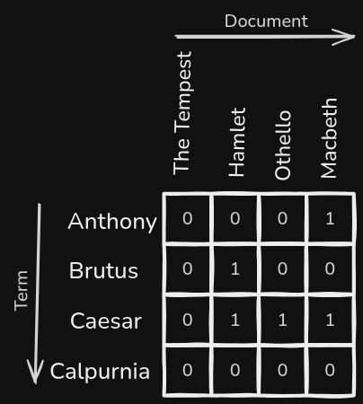

<p align="center">
    <a href="https://www.graalvm.org/">
        
    </a>
    <br />
    <a href="https://maven.apache.org/">
        
    </a>
</p>

# Incidence Matrix
This repository contains an implementation of a Boolean Incidence Matrix.

## Overview

> What is an Incidence Matrix?

An Incidence Matrix is a two-dimensional array where each cell represents a term's occurrence within a given "Document".

Typically, an incidence matrix has two axes representing:
1) the set of all Documents
2) the set of all Terms found across all Documents



> Note: An Incidence Matrix only marks that a term occurred within a Document. It does not specify the number of occurrences with each document.

In the above image, the `x-axis` represents the `corpus` we want to search while the `y-axis` represents the set of `terms` found across all `Documents` in the `corpus`. Each cell contains a bitwise value of `1` or `0`, respectively representing their boolean values `true` or `false`.

Let's take a look at a specific `<Document, Term>` cell where `<Document="Hamlet", Term="Brutus">`. The value at cell `<Hamlet, Brutus>` is `1`. This tells us that "the term `Brutus` was found in the document `Macbeth`".

If we look at the row `<Anthony, ?>`, we can see that the term `Anthony` was found in only one document - `Macbeth`; on the other hand, the term `Caesar` was found in three documents.

> What is the purpose of an Incidence Matrix?

TODO: talk about information retrieval, queries and the "benefits" of incidence matrices

## Terminologies
| Term | Definition |
|------|------------|
| corpus | TODO |
| document | TODO |
| term | TODO |

# High Level Design
## 1) Problem Statement
TODO - add details.

## 2) Constraints
TODO - add details.

# Prerequisites
This project requires the following:
* SDKMAN
* Java Runtime
* Maven

# Installation
Follow the instructions below to install SDKMAN:
```
https://sdkman.io/install
```

Run the following command to install the exact Java Graal version:
```bash
sdk env install
```

Run the following command to install the exact Maven Version:
```bash
sdk install maven 3.9.9
```

# Build
Run the following command to clean install dependencies:
```shell
mvn clean install
```

Run the following command to run unit tests via terminal:
```shell
mvn test
```

Run the following command to tokenize the `*.txt` file(s) via Maven + terminal:
```shell
mvn exec:java -Dexec.mainClass="com.search.App"
```

Run the following command to tokenize the `*.txt` file(s) via terminal:
```shell
java -cp target/incidence-matrix-1.0-SNAPSHOT.jar com.search.App
```

# License
[](./LICENSE)